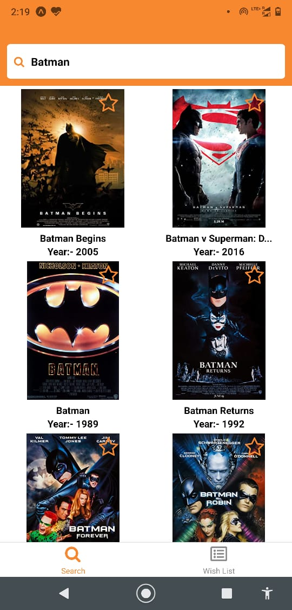
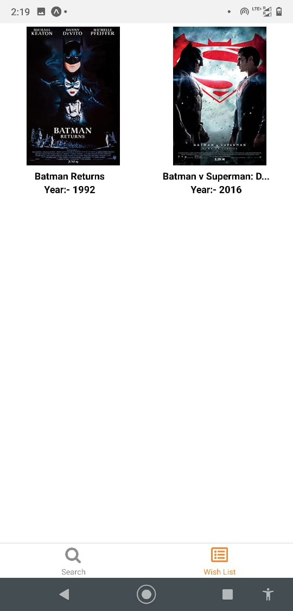

# About
> Basic Movie List App build in react-native using expo
> There are 2 Screens 
- 1st screen is Search screen where The user will search the movie from the search bar tap on any movie card displayed below to add to wish list.
- 2nd screen will display the movie added to wish list

## Feature's
- Search Bar with debouncing so api will get call after user stop searching for 500ms
- Implemented using redux boilerplate code for react-native
- 

## Prerequisite
- Node 
- expo cli

## Step to run the project
- clone the repo
- $ npm install
- $ expo start 
- $ expo ba     <!-- to build android apk -->

## demo image

